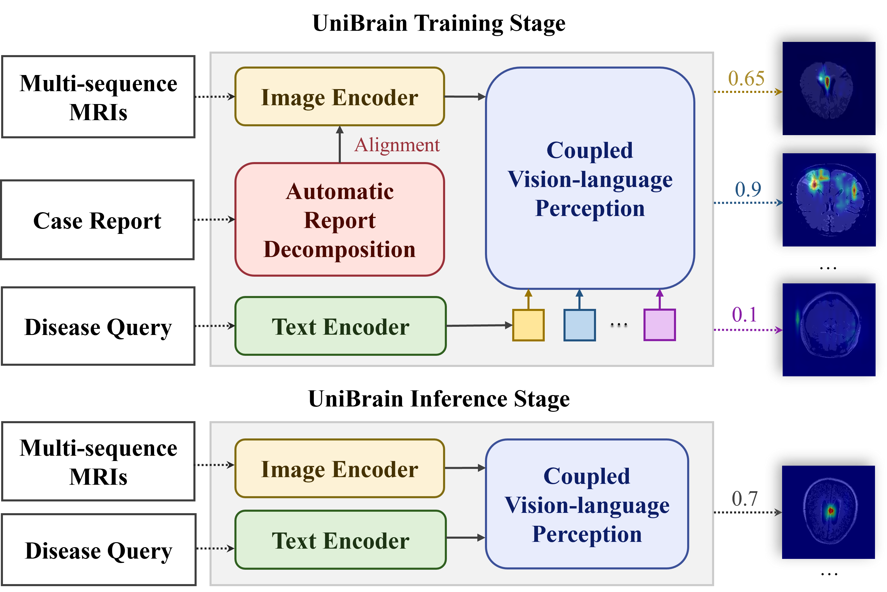

<!-- <h1> RaTEScore</h1> -->
<h1> UniBrain: Universal Brain MRI Diagnosis with Hierarchical Knowledge-enhanced Pre-training</h1>

Computerized Medical Imaging and Graphics已接收。
<div style='display:flex; gap: 0.25rem; '>
<!-- <a href='https://angelakeke.github.io/RaTEScore/'></a> -->
<a href='https://www.sciencedirect.com/science/article/pii/S0895611125000254'></a>
<a href='https://drive.google.com/drive/folders/1AjcxGVCGm6W40vkplXQYWmOsoG109bHH?usp=sharing'></a>

<!-- <a href='https://arxiv.org/pdf/2406.16845'></a> -->
</div>

## 介绍
在本研究中，我们提出的通用脑部MRI诊断系统（UniBrain）将视觉语言预训练（VLP）技术整合到MRI引导的脑部疾病分类任务中。该系统能够自动利用临床报告中的知识，提供灵活且可解释的脑部疾病分类结果。通过在大规模临床和公共数据集上的广泛实验，UniBrain在超过10种常见脑部疾病中展现出卓越的诊断能力，并在域外数据集上的新任务中表现出强大的泛化能力。具体贡献如下：

1. **结构化知识提取** 为从自由文本报告中高效提取结构化知识和疾病标签，我们基于放射科医生验证的临床术语开发了自动报告分解模块（ARD）。该模块开源且兼容多中心报告，大幅降低了人工标注成本。
2. **细粒度知识对齐** 通过利用报告的细粒度结构特征，UniBrain在序列级和病例级同时提升视觉特征学习效率。这种基于大规模临床数据集的分层知识增强预训练方案，显著提高了诊断准确率和模型扩展性。
3. **系统评估** UniBrain在十余种常见脑部疾病类型上的诊断性能超越现有开源基线方法，平均曲线下面积（AUC）达到90.71%。此外，该系统在域外数据集的新任务测试中展现出优异的泛化能力，验证了其临床实用价值。




## 模型使用
在[这里](https://drive.google.com/drive/folders/1AjcxGVCGm6W40vkplXQYWmOsoG109bHH?usp=sharing)下载UniBrain模型权重和文本编码器权重，下载后的文件请放于.\Brain_MRI\weights下。

安装运行环境：
```shell
pip install -r requirements.txt
```

每位患者的输入是四张MRI图片，且分别属于T1WI, T2WI, DWI, T2FLAIR模态。以下给出推荐的患者输入，在此示例中仅有一位患者，且此患者有四张MRI图像，且分别属于T1WI, T2WI, DWI, T2FLAIR模态，aux字段位每一个模态的id，存储在Brain_MRI\configs\modal_id.json，用户可更改。路径请都设置为绝对路径：

```json
[
    [
      {
        "data": "absolute/path/example/site1_065/DWI.nii.gz",
        "aux": "18"
      },
      {
        "data": "absolute/path/example/site1_065/T1WI.nii.gz",
        "aux": "1"
      },
      {
        "data": "absolute/path/example/site1_065/T2WI.nii.gz",
        "aux": "9"
      },
      {
        "data": "absolute/path/example/site1_065/T2FLAIR.nii.gz",
        "aux": "12"
      }
    ]
  ]
```

以下命令运行模型：
```shell
python sdk_api.py
```
模型会返回一个list，每个元素为一个字典，包含了对应患者的诊断信息，示例输出如下：
```json
[
    {
        "diagnosis": [
            "brain atrophy",
            "focal ischemia",
            "meningioma"
        ]
    }
]
```

## 联系我们
如果您有疑问，请联系邮箱： misslei@mail.ustc.edu.cn.

## 引用
```bibtex
@article{LEI2025102516,
title = {UniBrain: Universal Brain MRI diagnosis with hierarchical knowledge-enhanced pre-training},
journal = {Computerized Medical Imaging and Graphics},
pages = {102516},
year = {2025},
issn = {0895-6111},
doi = {https://doi.org/10.1016/j.compmedimag.2025.102516},
url = {https://www.sciencedirect.com/science/article/pii/S0895611125000254},
author = {Jiayu Lei and Lisong Dai and Haoyun Jiang and Chaoyi Wu and Xiaoman Zhang and Yao Zhang and Jiangchao Yao and Weidi Xie and Yanyong Zhang and Yuehua Li and Ya Zhang and Yanfeng Wang}
}
```